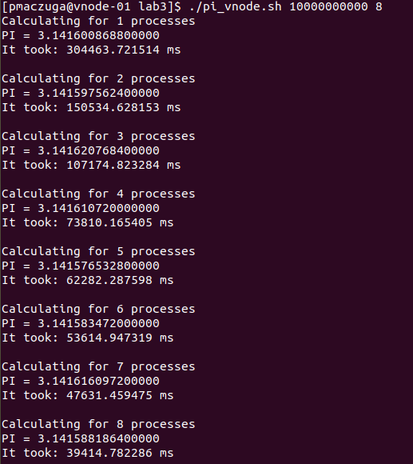
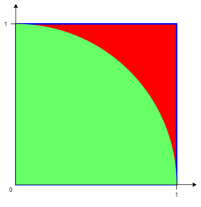

# MPI - Naturalna równoległość

## Sprawozdanie
Z powodu problemów z dostępem do Zeusa i Prometeusza ćwiczenie zostało wykonane na vnode'ach używanych w laboratorium 1.

Opis zawrtości:   
[seq.c](seq.c) - program w wersji sekwencyjnej   
[par.c](par.c) - program w wersji równoległej na MPI   
[pi.sh](pi.sh) - skryp, który byłby uruchomiony na Zeusie   
[pi_vnode.sh](pi_vnode.sh) - skrypt do uruchamiania programu dla różnych ilości procesów

Prównanie czasów wykonania dla różnych ilości procesów równoległych:   


## Cel ćwiczenia
Celem ćwiczenia jest zapoznanie się ze środowiskiem uruchamiania programów równoległych w infrastrukturze Cyfronetu (Zeus). Znajomość tego środowiska będzie niezbędna podczas wykonywania następnego laboratorium.

## Wrowadzenie
W ramach tego i następnego laboratorium będziemy dążyć do implementacji, a następnie analizy efektywności programu równoległego. Analiza taka daje bardzo intuicyjne i łatwe do interpretacji wyniki w przypadku problemów naturalnie równoległych. Jest to podzbiór problemów, w których część niemożliwa do zrównoleglenia jest pomijalna i nie ma wpływu na czas wykonania.

Przykładem problemu naturalnie równoległego jest obliczanie (przybliżanie) liczby π metodą Monte Carlo (MC). Metoda ta jest stosowana do modelowania matematycznego procesów zbyt złożonych (obliczanie całek, łańcuchy procesów statystycznych), aby można było przewidzieć ich wyniki za pomocą podejścia analitycznego. Istotną rolę w metodzie MC odgrywa losowanie (wybór przypadkowy) wielkości charakteryzujących proces, przy czym losowanie dotyczy rozkładów znanych skądinąd.

Algorytm obliczania liczby π metodą MC korzysta z zależności pomiędzy wartością liczby π a stosunkiem pola powierzchni koła o promieniu r do pola powierzchni kwadratu opisanego na tym kole:

- pole kwadratu: ,
- pole koła: `$P_k_o = \pi r^2$`,
- stosunek pola koła do pola kwadratu: `$P_k_o / P_k_w = (\pi r^2) / (4r^2) = \pi / 4$`,
- finalnie: `$\pi = 4 * P_k_o / P_k_w$`.

W efekcie, obliczenie liczby π metodą MC wymaga wykonania następujących kroków:

1. Wylosowanie pewnej liczby punktów rozłożonych równomiernie w kwadracie o boku 2r - przybliżamy w ten sposób pole kwadratu.
2. Zliczenie tych z punktów, które znajdują się wewnątrz koła wpisanego w ten kwadrat - przybliżamy w ten sposób pole koła.
3. Podzielić drugą wartość przez pierwszą, a wynik pomnożyć przez 4 - przybliżamy w ten sposób π.

Dla ułatwienia, problem można uprościć do jednej ćwiartki koła i kwadratu, a jako promień przyjąć wartość 1. Losujemy zatem punkty równomiernie rozłożone w niebieskim kwadracie, a dodatkowo zliczamy te leżące w zielonym obszarze (patrz rysunek poniżej).



Zrównoleglenie tego algorytmu jest naturalne (jak sugeruje nazwa naturalna równoległość). Parametrem, który dyktuje rozmiar problemu, jest liczba punktów do wylosowania - im więcej punktów, tym lepsze przybliżenie. Podział pracy pomiędzy węzły obliczeniowe sprowadza się więc do podziału liczby punktów przez liczbę węzłów, na każdym węźle wylosowanie tylu punktów i zliczenie punktów w okręgu, a finalnie przesłanie wyników do jednego węzła. Jedyną częścią programu, która będzie musiała wykonać się sekwencyjnie to zsumowanie wyników z poszczególnych węzłów i wyliczenie wartości π. Narzut na komunikację jest minimalny - każdy węzeł musi wysłać jedną liczbę.

## Przepieg ćwiczenia

### Wersja sekwencyjna
Stwórz sekwencyjną wersję programu wykorzystującego metodę MC do wyznaczania liczby `$\pi$`. Opis algorytmu znajdziesz we wprowadzeniu. Zapewnij możliwość podania liczby punktów jako argument wywołania programu.

Uruchom kod kilkukrotnie upewniając się, że zwracany wynik jest zbliżony do `$\pi$`. **Zachowaj kod** do wgrania jako jeden z wyników laboratorium.

*Opcjonalnie*: uruchom program wielokrotnie dla różnych rozmiarów problemu (np. 1e2, 1e4, 1e6, 1e8), dla każdego wyliczając średni wynik i odchylenie standardowe. Jaki wpływ na te wartości ma rozmiar problemu? Wyniki możesz załączyć w dowolnej postaci (tekst, wykres) jako jeden z wyników laboratorium.

Wskazówki:

- Wylosowanie liczb równomiernie rozłożonych na prostokącie jest równoważne z wylosowaniem obu współrzędnych niezależnie.
- W celu sprawdzenia czy punkt należy do okręgu możesz wykorzystać równanie okręgu lub wzór na długość wektora.
- W celu obserwacji efektywności zrównoleglenia konieczne będzie losowanie dużych liczb punktów, np. `$10^12$`. Upewnij się, że zmienne pomieszczą takie liczby bez przepełnienia.

### Wersja równoległa
Zmodyfikuj program tak, żeby korzystając z MPI rozdzielał problem na wiele procesorów. Dodaj pomiar czasu w odpowiednich miejscach. Uważaj, żeby mierzyć tylko faktyczny czas pracy programu - dodaj bariery tam gdzie to konieczne. 

Program nie wymaga wymiany informacji na początku obliczeń - nie będzie więc potrzebna komunikacja typu *broadcast* / *scatter*. Konieczne jest jednak zebranie wyników obliczeń każdego z procesorów w jednym i obliczenie `$\pi$`. Możesz skorzystać z funkcji *gather*, jednak w tym przypadku lepszym wyjściem będzie funkcja *reduce*. Ponieważ znana jest liczba wszystkich punktów, potrzebna jest tylko suma punktów wewnątrz okręgu we wszystkich losowaniach - poszczególne wyniki osobno nie są potrzebne. 

Uruchom kod kilkukrotnie upewniając się, że wynik nadal jest zbliżony do π, a czas maleje dla większej liczby procesorów (do liczby procesorów wspieranej przez maszynę, na której jest uruchamiany). **Zachowaj kod** do wgrania jako jeden z wyników laboratorium.

Wskazówki:

- https://mpitutorial.com/tutorials/mpi-reduce-and-allreduce/
- Pamiętaj, że funkcje implementujące komunikację w C nie zwracają wyników - są one umieszczane w zmiennych, których adresy są przekazywane jako parametry.
- W tym programie potrzebna jest tylko jedna bezpośrednia bariera - druga jest wymuszona przez komunikację zbiorową.

### Uruchomienie na Zeusie - tryb interaktywny
Na portalu PL-Grid upewnij się, że masz aktywne konto, aktywny grant testowy, oraz aktywną usługę "Dostęp do klastra ZEUS" (Portal PL-Grid -> Usługi -> Zarządzaj usługami -> wyszukaj "zeus" -> Aplikuj)

Zaloguj się do klastra wykorzystując swoje dane PL-Grid:   
`$ ssh plgusername@zeus.cyfronet.pl`

Upewnij się, że widoczny jest grant obliczeniowy:   
`$ plg-show-grants `
Na wyświetlonej liście powinien pokazać się grant plgusername2020a

W celu upewnienia się, że masz dostęp do prowadzenia obliczeń w ranach tego grantu:   
`$ srun --nodes=1 --ntasks=1 --exclusive --time=00:10:00 --partition=plgrid --account=plgusername2020a --pty /bin/bash`   
W efekcie konsola może zawisnąć na czas zależny od obciążenia systemów kolejkowych, po czym powinna uaktywnić się nowa powłoka - katalog roboczy się nie zmieni, ale wszystkie polecenia będą teraz wykonywane w kontekście instancji obliczeniowej, która właśnie została stworzona - jest to tryb interaktywny korzystania z systemu kolejkowego.

Ten tryb jest bardzo wygodny na etapie tworzenia i testowania rozwiązania. Warto rozumieć parametry polecenia, które go uruchomiło:

- --nodes - liczba węzłów obliczeniowych dostępnych dla zadania. - Komunikacja pomiędzy nimi może być wolniejsza ze względu na konieczność komunikacji sieciowej, więc na potrzeby zajęć będzie on wynosić zawsze 1.
- --ntasks - liczba procesorów dostępnych dla zadania. Komunikacja pomiędzy nimi powinna być szybka, jeżeli są one w obrębie jednego węzła, na zajęciach będziemy potrzebować od 1 do 16.
- --exclusive - zasoby nie będą współdzielone z innymi zadaniami - mogłoby to wpłynąć na czasy działania.
- --time - czas przydziału instancji w formacie hh:mm:ss, po którym zostanie odebrana. Większy czas daje więcej swobody, jednak może oznaczać dłuższy czas oczekiwania w kolejce.
- --partition - różne partycje mają różne parametry, dostępne zasoby i wymagania. "plgrid" to domyślna wartość i wystarczy na potrzeby zajęć.
- --account - nazwa grantu.
- --pty /bin/bash - instrukcja dla polecenia, że powinna uruchomić tryb interaktywny z podaną powłoką.

Domyślnie nie są dostępne żadne narzędzia developerskie - sami musimy je zażądać. W celu uzyskania dostępu do narzędzi potrzebnych na zajęciach, wywołaj polecenie:   
`$ module add plgrid/tools/openmpi/1.6.5-gnu-4.9.2-ib`
Sprawi to, że z poziomu zadania widoczne będą niezbędne narzędzia, które umożliwią budowanie i uruchamianie zadań wykorzystujących MPI. Teraz możesz wykorzystać wiedzę z poprzednich zajęć do uruchomienia swojego kodu - działać będą komendy mpicc i mpirun/mpiexec. Mogą pojawiać się dodatkowe komunikaty wynikające z mnogości wersji wielu bibliotek, niekoniecznie w pełni ze sobą współpracujących - jeżeli wyniki wydają się poprawne, można je zignorować.

Uruchom tryb interaktywny z parametrem `--ntasks=16`, dodaj moduł MPI, skompiluj kod i porównaj czas wykonania wybranego rozmiaru problemu dla 1 i 12 procesorów (parametry dla MPI -np 1 i -np 12). Dobierz taki rozmiar problemu, żeby wersja dla 12 procesorów wykonywała się co najmniej 1 sekundę. **Zrób zrzut ekranu** do wgrania jako jeden z wyników laboratorium. 

### Uruchomienie na Zeusie - tryb wsadowy
W celu analizy efektywności na potrzeby sprawozdania po następnych zajęciach, potrzebna będzie możliwość uruchomienia kodu bez konieczności nadzoru i utrzymywania aktywnej konsoli. W tym celu potrzebne będzie wykorzystanie komendy sbatch. Przyjmuje ona te same parametry, które były analizowane powyżej. Wygodniej jednak jest wykorzystać tę funkcję przekazując do niej skrypt, który będzie zawierać te parametry.

Utwórz nowy plik pi.sh, który posłuży jako wsad dla systemu kolejkowego. Na początku pliku wstaw shebang oraz parametry dla komendy sbatch:

```
#!/bin/bash -l
#SBATCH --nodes 1
#SBATCH --ntasks 16
#SBATCH --exclusive
#SBATCH --time=01:00:00
#SBATCH --partition=plgrid
#SBATCH --account=plgusername2020a
```

Uwaga: wszystkie znaki "#" są potrzebne, a pomiędzy "#" i "SBATCH" nie ma spacji. 

Dalszą część pliku możesz potraktować jak zwykły skrypt bashowy. Umieść w nim komendę, która załaduje moduł MPI (module add ...), oraz komendę, która skompiluje program (mpicc ...). Na końcu dodaj komendę, która wykona skompilowany program.

Uruchomienie takiego skryptu jest proste:   
`$ sbatch pi.sh [argumenty, skryptu...]`   
Otrzymasz informację, że skrypt został zgłoszony do kolejki. Status można podejrzeć komendą squeue. Zadanie nie jest już zależne od konsoli i rozłączenie/ponowne połączenie się z klastrem nie wpłynie na jego wykonanie. Po zakończeniu działania zadania w katalogu, w którym został on wykonany pojawi się plik `slurm-<nr zadania>.out`, który zawiera całe wyjście zadania. Sprawdź, czy wszystko przebiegło bez problemów.

Zmodyfikuj skrypt tak, żeby przyjmował rozmiar problemu i przekazywał dalej do programu MPI. Dodaj drugi parametr skryptu, którym będzie maksymalna liczba procesorów. Zamień wykonanie programu w skrypcie na pętlę, która wykona program dla liczby procesorów od 1 do zadanego maksimum. **Zachowaj skrypt** do wgrania jako jeden z wyników laboratorium.

Wskazówki: 

- W razie pomyłki zadanie można wycofać z kolejki poleceniem scancel <nr zadania>.
- Pętlę w bashu z wykorzystaniem parametru wywołania skryptu możesz napisać np. tak:
```
for ((i=1; i<=$1; i++)); do
    echo "$i"
done
```
